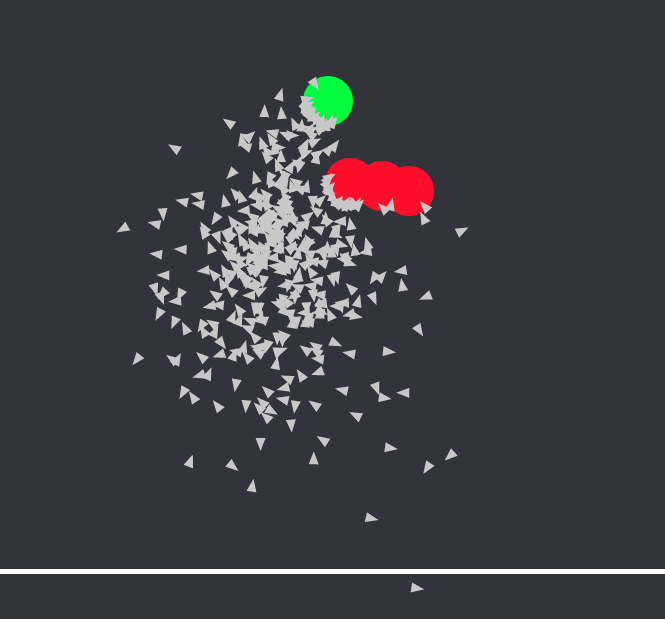

# evolving_explorers
A simple visualization for a simple genetic algorithm, using p5.js

I made this with [Fruspa](https://github.com/Fruspa) a few years ago, might update it someday to add features.

Clone the repo, open index.html to run the webpage, leftclick anywhere to move the red target.
